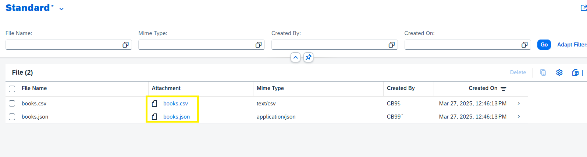

# ABAP BTP Cloud, Download files from ABAP program to local PC

In the ABAP BTP cloud environment with Eclipse, there is no known way of downloading a file from an ABAP program to a local PC. The on-premise solutions like using `cl_gui_frontend_services` do not work in ABAP cloud with Eclipse ADT. This ABAP repository builds the functionality in two steps:

## Step 1
Save the file contents as `RAWSTRING` in database table `zfio_files`.

## Step 2
Use table `zfio_files` to generate an ABAP RAP based Fiori elements UI.

The Fiori application streams the contents of the file from database on the UI as an attachment from where users can download the file.

## Implementation Details
- **Database Storage**: Files are stored in the `zfio_files` table as `RAWSTRING`.
- **UI Layer**: ABAP RAP (RESTful Application Programming) model is used to expose the data.
- **User Experience**: Files appear as attachments in the Fiori UI for easy download.

## Usage
#### To use this functionality:
- Clone or Download this repo  using [abapGit Plugin](https://developers.sap.com/tutorials/abap-install-abapgit-plugin..html)
- Store file contents in your ABAP program to database using the provided ABAP method `create_files` of class  `ZFIO_FILES_SAVE_TO_DB`.
   Check demo class `ZCL_FIO_FILE_SAVE_DEMO` which can be run as application with eclipse adt
   
   ```abap
   METHOD if_oo_adt_classrun~main.
    TYPES: BEGIN OF sample_row,
             book_name TYPE c LENGTH 128,
             author    TYPE c LENGTH 128,
             rating    TYPE p LENGTH 2 DECIMALS 2,
           END OF sample_row.

    DATA files       TYPE zfio_tt_files.
    DATA sample_data TYPE STANDARD TABLE OF sample_row.

    sample_data = VALUE #(
        (  book_name = 'The Psychology of Money'  author = 'Morgan Housel'  rating = '4.3' )
        (  book_name = 'The Millionaire Next Door'  author = 'Thomas J. Stanley, William D. Danko'  rating = '4.04' )
        (  book_name = 'Thinking, Fast and Slow'  author = 'Daniel Kahneman'  rating = '4.17' ) ).

    DATA(csv_string) = convert_to_csv( sample_data  ).
    DATA(json_string) = convert_to_json( sample_data ).

    DATA(books_csv_xtring) = cl_abap_conv_codepage=>create_out( codepage = `UTF-8` )->convert( csv_string ).
    DATA(books_json_xtring) = cl_abap_conv_codepage=>create_out( codepage = `UTF-8` )->convert( json_string ).

    files = VALUE #( ( file_mimetype = 'text/csv' file_name = 'books.csv' file_content = books_csv_xtring )
                     ( file_mimetype = 'application/json' file_name = 'books.json' file_content = books_json_xtring ) ).

    DATA(file_save_obj) = NEW zfio_files_save_to_db( ).

    TRY.
        file_save_obj->create_files( files = files ).
        out->write( 'Records Updated Use Service Binding ZFIO_UI_FILES_OV4 to Launch the Fiori App' ).
      CATCH zcm_fio_checks INTO DATA(fio_error).
        out->write( fio_error->get_text( ) ).
    ENDTRY.
  ENDMETHOD.
  ```

- Access the Fiori application to view and download the files using service binding  `ZFIO_UI_FILES_OV4` .
     
     
- Download the file from Fiori UI by clicking on field *Attachment*
     
   
## Restrictions:
- This repo does not support converting data to CSV or JSON as shown in the demo class. The demo examples are for testing purposes only.
- This repo has only been tested on ABAP BTP cloud environment and may not work in on-premise systems.
